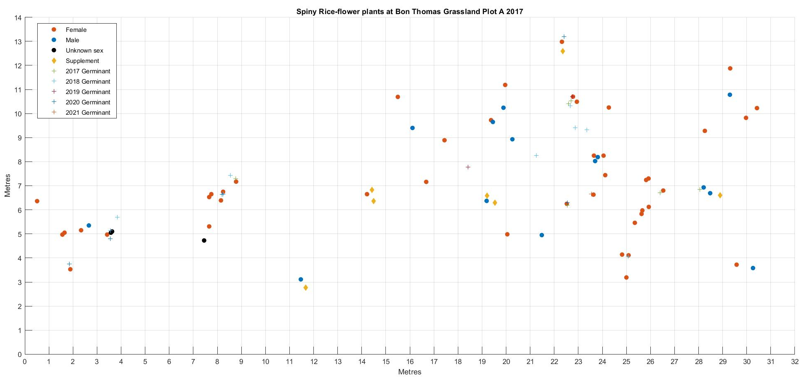

```{r, include = FALSE}
knitr::opts_chunk$set(
  collapse = TRUE,
  comment = "#>"
)
```

```{r setup}
library(SpinyRiceFlowers, attach.required=TRUE)
```

```{r, include=FALSE}
if(!require('spatstat')) {
  install.packages('spatstat')
  library('spatstat')
}

if(!require('tidyverse')) {
  install.packages('tidyverse')
  library('tidyverse')
}


if(!require('MASS')) {
  install.packages('MASS')
  library('MASS')
}

if(!require('MASSExtra')) {
  install.packages('MASSExtra')
  library('MASSExtra')
}

if(!require('kableExtra')) {
  install.packages('kableExtra')
  library('kableExtra')
}

if(!require('SIBER')) {
  install.packages('SIBER')
  library('SIBER')
}

if(!require('rstan')) {
  install.packages('rstan')
  library('rstan')
}

if(!require('readxl')) {
  install.packages('readxl')
  library('readxl')
}

if(!require('ggdensity')) {
  install.packages('ggdensity')
  library('ggdensity')
}

library(SpinyRiceFlowers)

```

## Introduction

Spiny Rice-flower *Pimelea spinescens* subsp. *spinescens* is a small dioecious sub-shrub that is endemic to the lowland grasslands and grassy woodlands of Victoria (@entwisle98). It is listed as Critically Endangered under the Commonwealth Environment Protection and Biodiversity Conservation Act 1999, and also under the Victorian Flora and Fauna Guarantee Act 1988.

Spiny Rice-flower is typically associated with the Critically Endangered Natural Temperate Grassland of the Victorian Volcanic Plain and thus habitat loss and fragmentation are significant threats @DCCEEW2024. It is a long-lived species that appears to have low rates of infrequent recruitment (@Reynolds2013). Drivers of population change have been most strongly associated with habitat management (especially biomass management), as well as population density and climate events/trends (@Reynolds2013). To better understand these drivers and manage for positive population growth, further research and ongoing monitoring is required (DCCEEW, 2024).

Over the last decade, the Pimelea spinescens Recovery Team has used a Monitoring Protocol (@Reynolds2014a) and Monitoring Guidelines (@Reynolds2014b) to direct the approach taken for assessing populations. The method is useful for tracking the fate of individual plants but is less useful for estimating the population size and trajectory, especially when there are hundreds/thousands of individuals or the population is dispersed over a wide area.

This project aimed to inform potential amendments/additions to the Monitoring Protocol and Guidelines, particularly in relation to determining the number and size of quadrats to be assessed at each site. To do this, an analysis of data derived from two separate studies was undertaken:

-   Longitudinal population assessments (O'Shea, unpublisged data 2017-2021)
-   One-off statewide evaluations (@OShea2024)

## Methods

Longitudinal population assessments were undertaken annually over five consecutive years (2017-2021) and at four different grassland conservation reserves in urban Melbourne:

-   Bon Thomas (west) Grassland (managed by Brimbank City Council – BCC)

-   Denton Avenue Grassland (managed by BCC)

-   Iramoo Wildflower Grassland Reserve (managed by the Cairnlea Conservation Reserves Committee of Management - CCRCoM)

-   Pimelea Wildflower Grassland (managed by CCRCoM)

The location of monitoring plots was established by undertaking an initial reconnaissance of each site and flagging individuals or clusters of Spiny Rice-flower plants in order to develop a rough understanding of their spatial distribution. Allowing for a buffer of 1m, a permanent rectangular monitoring grid was defined that encompassed all the flagged plants, thus the dimensions of each grid varied – the largest grid measured 36m x 20m; and the smallest was 6m x 4m. Grids roughly followed a north-south direction, the corners were marked with large wooden stakes, and the stake on the south-west corner formed the 0,0 cartesian coordinates. Six study grids were established at Pimelea Wildflower Grassland but there were only two grids at all other sites.

Annual monitoring was undertaken by dividing each grid into a series of 1m wide transects in the north-south direction (note that the length of transects was different for each grid due to the variation in dimensions). Each transect was slowly traversed to look for Spiny Rice-flower plants. When a plant was detected, the following data was recorded:

-   Location on the x-axis (to the nearest 5cm increment)

-   Location on the y-axis (to the nearest 5cm increment)

-   Health status (Alive or Dead)

-   Flowering status (Flowering or non-flowering)

-   Sex (Female, Female dominated, Male, Male dominated, Hermaphrodite)

-   Diameter (measured at the widest point of the living above-ground vegetation in centimetres)

-   Recruitment status (existing or recruit). Observed germinants were recorded at each assessment, however the number observed is likely to be only a subset of the true number of germinants that were produced and died before they could be counted. Plants were considered germinants if they had not previously been observed (years 3, 4 & 5); or had cotyledons, or were very small in size and lacked woody branching stems (years 1 & 2). Germinants were counted as ‘recruits’ if they were still present in the subsequent assessment (approximately a year later). All other plants were categorised as ‘existing’.

All detected plants were permanently marked using individually numbered aluminium disks which were fixed to the substrate on the southern side of the plant with a stainless steel orchid pin.

For the Statewide Evaluation (@OShea2024), Spiny Rice-flower populations were located using coordinates supplied by the *Pimelea spinescens* Recovery Team. When the first plant was found, it was temporarily flagged and a survey for subsequent plants was undertaken. This was done by walking in roughly 1m transects. At linear sites the transects were in zig-zags but at non-linear sites the search was done in a spiral pattern. Each plant detected was temporarily flagged and the search continued until there was a distance of at least 50m with no SRF plants present. Up to four of the outermost plants were permanently tagged (as per above description). In the process of removing the flags, a waypoint mark was recorded for each individual plant using a Garmin 60 GPS device.

Using Site 19 Banyena Silo Road as an example, GPS waypoints were entered into the QGIS mapping software version 3.28.11 to create a spatial map of the distribution of all plants within the population. Within QGIS a rectangular 1m x 1m grid was created across the area of plant distribution – the grid was bounded by the road and paddock fence but,  a  10m (approx.) buffer was allowed at each end of the rectangle. The resulting grid cove red an area measuring 359m x 14m (5026m^2). The number of plants within each 1m x 1m cell were tallied using the count function in QGIS.

## Data analysis

Analyses were undertaken on the data from the longitudinal population assessments; and the developed approach was then applied to a single sample site from the Statewide Evaluation data.

To analyse the longitudinal population assessment data, the following simple model was assumed:

-   Plants survive from year to year with probability $p_1$.
-   The number of germinants per 100 square metres follows a Poisson process with rate per square metre equal to $\lambda$.
-   Germinants survive the first year with probability $p_2$, at which stage they are referred to as 'recruits'

In addition, some priors for the parameters are required. The priors used were:

-   $\log\left(\frac{p_1}{1-p_1}\right)$ has a Normal distribution with mean 3 and standard deviation 1.5.
-   $\log\left(\frac{p_2}{1-p_2}\right)$ has a Normal distribution with mean 1 and standard deviation 1.5.
-   $\log(\lambda)$ has a Normal distribution with mean 2 and standard deviation 1.5.

The model was fitted using Stan (@Stan) with the RStan (@RStan) package in R.

Based on the fitted model, predictions into the future can be made for both the total number of plants and the number of germinants/recuits.

If necessary, the model could be modified to allow the parameters to vary by year. A hierarchical model was also fitted to the data involving all the sites. This allows some shrinkage of the parameters avoiding over-fitting.

While an annual complete census of each site would be ideal, economic considerations make a sampling approach desirable. For each grid at each site, the location of plants was used to create a heat map, calculated using the `kde.boundary` function from the **ks** package (@KS) in R. Given a set of points, a kernel estimate of the density of plants over the region, $f(x,y)$, is calculated. The method used by `kde.boundary`, based on the method given by @Chen99, considers that the region is finite, while some kernel estimates, such as the `kde2d` function in the **MASSExtra** package (Venables, 2023), are biased at the boundaries of the region.

Once the density, $f(x,y)$, is estimated, and assuming quadrat sampling is used, then it is useful to determine the estimated proportion of plants being in a particular quadrat bounded by $(x_1,y_1)$ on the lower left and $(x_2,y_2)$ on the upper-right. The probability is given by $$\int_{x_1}^{x_2}\int_{y_1}^{y_2}f(x,y)\ dy\ dx,$$ which can be calculated by using numerical integration.

Assume that a complete census has been undertaken in year $t_1$ and a sample of quadrats will be taken in year $t_2$. For annual monitoring, $t_2=t_1+1$, however the method below is more general and covers cases where monitoring is not done annually. Denote the number of plants in year $t$ as $y_t$, with the number of recruits between year $t_1$ and year $t_2$ as $r(t_1,t_2)$ and the number of dead plants between year $t_1$ and year $t_2$ as $s(t_1,t_2)$. Then $$y_{t_2}=y_{t_1}+r(t_1,t_2)-s(t_1,t_2).$$ Note that $r(t_1,t_2)-s(t_1,t_2 )$ denotes the change from year $t_1$ to year $t_2$ and can be estimated by using the Horvitz-Thompson estimator (see for example @complexsurveys, page 5) as

$$\hat{T}_X=\sum_{i=1}^{n}\frac{1}{\pi_i}X_i  $$

where $X_i$ is the difference between the number of recruits and the number of dead plants observed in the $i$th sampled quadrat and $\pi_i$ is the inclusion probability, the probability that the $i$th quadrat is included in the sample.

The calculated heatmap is based on existing plants that have survived 12 months up to year $t_1$. We have included plants that have died and germinants that have persisted for at least 12 months (recruits). Updates to the heatmap can be made as new data becomes available but must reflect the sampling program.

The inclusion probabilities are estimated by simulation. For various quadrat sizes, the possible quadrats were sampled without replacement with sampling weights given by the calculated probability of a plant being in a particular quadrat. The `sample_int_crank` function in the **wrswoR** package (@wrswoR) was used. 10,000 possible samples of maximum sample size were taken. For example, for Bon Thomas A with a grid size of 35m by 15m, there are 21 possible 5m by 5m quadrats. A 21 by 10000 matrix was obtained with each column corresponding to a weighted random sample of the quadrats with weights proportional to the calculated proportion of plants within each quadrat. To determine the (approximate) inclusion probabilities for a sample of size of $n=10$ , say, a tabulation of the values in the top $n$ rows of the matrix was made, with the inclusion probability for a quadrat being estimated as the count of that quadrat divided by 10,000.

## Results

The methods applied for the longitudinal study enabled the location of each individual plant to be measured and mapped with an average accuracy of 0.091m on the x-axis and 0.101m on the y-axis(Figure \@ref(fig:plantlocations) provides an example). For each study plot, the rates of mortality, natality and population change over the 5 year period were calculated (table xxx). These measures varied widely both within and between sites, with average yearly mortality being as high as 7.7% at Iramoo A; average yearly natality as high as 47.2% at Pimelea A; positive (or neutral) population growth for all plots except Pimelea E. At Denton A, population growth was as high as 228.3%.

```{r plantlocations, echo=FALSE,fig.cap="Location of plants in the Bon Thomas Grassland Plot A during 2017-2021.", out.width="75%"}


```

For each study plot, the results of a heat map (Figure \@ref(fig:heatmap) provides an example) were used to create an inclusion probability plot (Figure \@ref(fig:incprobs) provides an example).


```{r heatmap,echo=FALSE, warning=FALSE, message=FALSE, fig.cap="Location of plants in the Bon Thomas A grid and associated heatmap" , out.width="60%"}

HeatMap(AllPlantsby2020[,2:3],xrange=c(0,35), yrange=c(0,15), gridsep=5, title="Heat map for Bon Thomas A")

```


```{r incprobs, echo=TRUE, warning=FALSE, message=FALSE, fig.cap="Relationship between quadrat probability and inclusion probability for quadrat sizes 5m by 5m and sample size equal to 10 " , out.width="60%"}
qprobs5 <- quadratprobs(AllPlantsby2020[,2:3], quadratstart=c(0,0),quadratsize=5,
                       xmin=c(0,0),xmax=c(35,15) )
incprobs5 <- inclusionprobs(qprobs5,nsim=10000)
DF <- data.frame(quadratprobs=as.numeric(qprobs5), incprobs=as.numeric(incprobs5[10,-1]))
library(ggplot2)
ggplot2::ggplot(DF, aes(quadratprobs, incprobs))+
  geom_point()+
  labs(x="Quadrat Probability", y="Inclusion Probability")+
  ggtitle("Bon Thomas A: 5m by 5m quadrats, Sample Size=10")

```


Sampling targets were set to achieve (in order of priority):
  
1.  A low coefficient of variation (CV), aiming for \<10%
2.  A sample size of 6 -12, which would be achievable within a one day sampling session by community groups
3.  The smallest possible sampling quadrat size

Thus, using the example of Bon Thomas A, a proposed monitoring program would use 5m x 5m quadrats to take 12 samples, achieving a CV of 8.27%.

Bayesian models fitted to each plot across the five year sampling period enabled predictions of the size of each population for 10 years into the future (@fig-BonThomasABayes1). For Bon Thomas A, the model predicts steady population growth with 72 plants present in 2031, albeit there is a high level of uncertainty.xxxxx .

The modelling approach developed for the longitudinal study sites was applied to the Statewide Evaluation Site 19 Banyena-Silo Road. Application of a heat map and inclusion probability curve enabled the coefficients of variation to be calculated for a range of quadrat sizes and sample areas (@fig-Site19HeatMap and @fig-Site19CVSS, respectively).

Spiny Rice-flower populations are primarily found in grasslands (and occasionally grassy woodlands) distributed through north, central and western Victoria. The Statewide Evaluation for Spiny Rice-flower (O’Shea, 2024) recommends regular and ongoing monitoring of at least 8 populations in each of the following categories, giving rise to 28 identified target populations:
  
  -   Regional location - Northern Victoria; Western Victorian Volcanic Plain; and Victorian Volcanic Plain Port Phillip

-   Land-use category – Linear Service Way; Non-linear Reserve; and Private-Rural

-   Population size – Small (≤100 individuals); Medium (101-999 individuals); and Large (≥1,000 individuals)

## Site 19

A similar analysis was done for Site 19. Quadrat counts were made for 1m by 1m quadrats parallel to the road adjacent to the site.

Reisch et al 2018

•	methods that surveyed the whole population also systematically yielded lower counts when species were less visible and when the area was larger

•	estimates from different methods should not be mixed, and that plot or transect based surveys have likely smaller biases for large areas or poorly visible individuals, and are therefore preferable.

•	The choice of the method had a significant influence on the estimated population size

•	Concerning the question whether population size estimates depend on species traits, we found that higher/lower visibility was associated to higher/lower population size estimates for the site-based methods as opposed to the plot-based methods

•	site-based methods, meaning that the estimated population densities decreased with area

•	site-based methods find less individuals, lower count rates for less visible species and smaller population

•	This interpretation is in line with previous studies suggesting that counting all individuals underestimates population size at large study sites 

•	plot-based methods should be preferred, when estimating population size of more frequent species in larger habitats

•	plot-based methods may exhibit higher variability of the estimates at low population density. At which densities and under which conditions such effects occur should be analysed in further studies

•	mixing site-based and plot-based estimation methods in the same study is problematic.

•	site-based observations exhibit a bias towards lower population sizes, especially when areas are large and the visibility of a species is poor.

Flesch et al 2019

•	The recommended survey method for this species, however, calls for a complete census of all individuals in a given focal area, which is time intensive and costly (Roller 1996a; USFWS 2007, 2018). In this and other similar contexts, survey methods based on sampling theory should be capable of accurately estimating population size, distribution, and other parameters with greater efficiency across larger areas.

•	We compared estimates of population size and densities of the PPC derived from Distance Sampling to values from intensive recent censuses, and assessed the magnitude of estimation bias and factors that explain bias.

•	Such patterns suggest PPC distribution is sufficiently uniform to eliminate issues imposed by clustering (Buckland et al. 2007, 2015), even though plants sometimes occurred in small groups of individuals 5–20 m apart. In other systems, more extreme clustering may require crossed designs or more complex approaches (see Buckland et al. 2007), or cluster-based estimation where numbers of individuals in clusters is used as detection covariate (Thomas et al. 2010).

Spiny Rice-flower populations are primarily found in grasslands (and occasionally grassy woodlands) distributed through north, central and western Victoria.  The Statewide Evaluation for Spiny Rice-flower (O’Shea, 2024) recommends regular and ongoing monitoring of at least 8 populations in each of the following categories, giving rise to 28 identified target populations:
  
  •	Regional location - Northern Victoria; Western Victorian Volcanic Plain; and Victorian Volcanic Plain Port Phillip

•	Land-use category – Linear Service Way; Non-linear Reserve; and Private-Rural

•	Population size – Small (≤100 individuals); Medium (101-999 individuals); and Large (≥1,000 individuals)


## References
